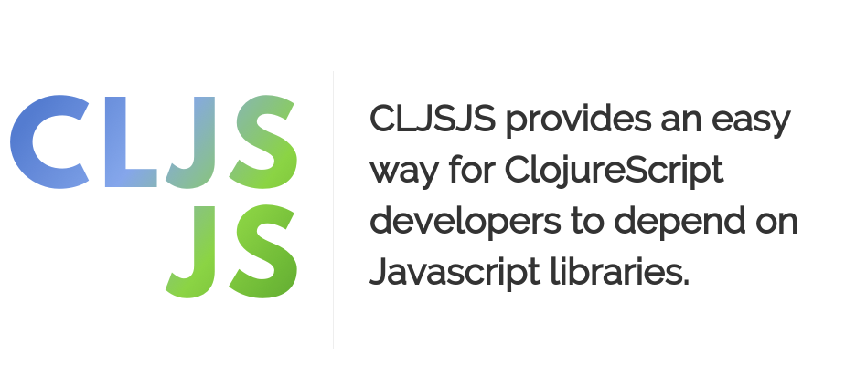

% ClojureScript & Figwheel
% Jordan Schatz
% Thursday, 03. March 2016


## Show me the code!

Slides and such are at:

[https://github.com/shofetim/cljs-and-figwheel-presentation](https://github.com/shofetim/cljs-and-figwheel-presentation)

## Current State of the Art

(in JS land)

### We are going to need a few things...

<aside class="notes">
Que dramatic presentation!
</aside>

### Bower!


### Browserify!


### Grunt!


### Gulp!


### Less!


### Sass!


### Stylus!


### NPM!


### Yeoman!


### WebPack!


###


## What do we get?

### Some interesting syntax
```js
let {x, y ...vals} = {x: 1, y: 2, x: 3, _: 4};
let nums =
  () =>
  (function* (xs) {
    for (let i of xs)
    {let  [arg1, arg2] = xs;
     yield i ** (arg1 + arg2)}
    yield* (for (c of [4,5,6]) if (c!==4) c**c);
  })([1,2,3]);
for (let n of nums()) ::console.log('n: ' + n);
::console.log([...nums()]);
```
### Dependency injection

```js
app.controller(
    'DashboardController',
    ['$window', '$scope', '$rootScope', '$interval',
     function($window, $scope, $rootScope, $interval) {
     }]);
```

### Edit, reload, click
### Whoops... Edit, reload, click
### Whoops... Edit, reload, click
### Grr...

## An alternative

- Lein
- ClojureScript
- Figwheel
- (maybe Docker?)

## Lein

### Handles dependencies

### CLJS.JS

[http://cljsjs.github.io/](http://cljsjs.github.io/)


### And everything else

- Compilation
- Build / unification
- Even deploy...

## What is Figwheel?
###
### Live code reloading

If you write [**reloadable
code**](https://github.com/bhauman/lein-figwheel#writing-reloadable-code),
figwheel can facilitate automated live interactive programming. Every
time you save your ClojureScript source file, the changes are sent to
the browser so that you can see the effects of modifying your code in
real time.

### Supports Node.js

You can [use figwheel to live code ClojureScript in Node.js](https://github.com/bhauman/lein-figwheel/wiki/Node.js-development-with-figwheel)!

### Static file server

The inclusion of a **static file server** allows you to get a decent
ClojureScript development environment up and running quickly. For
convenience there is a `:ring-handler` option so you can load a ring
handler into the figwheel server.

### Live CSS reloading

Figwheel will reload your CSS live as well.

### Live JavaScript reloading

Figwheel can live reload your JavaScript source files.

### Heads up display

Figwheel has a non-intrusive heads up display that gives you feedback
on how well your project is compiling. By writing a shell script you
can click on files in the heads up display and they will open in your
editor!

### Built-in ClojureScript REPL

When you launch figwheel it not only starts a live building/reloading
process but it also optionally launches a CLJS REPL into your running
application. This REPL shares compilation information with the
figwheel builder, so as you change your code the REPL is also aware of
the code changes. The REPL also has some special built-in control
functions that allow you to control the auto-building process and
execute various build tasks without having to stop and rerun lein-figwheel.

### Robust connection

Figwheel's connection is fairly robust. I have experienced figwheel
sessions that have lasted for days through multiple OS sleeps. You can
also use figwheel like a REPL if you are OK with using `print` to output
the evaluation results to the browser console.

### Message broadcast

Figwheel **broadcasts** changes to all connected clients. This means you
can see code and CSS changes take place in real time on your phone and
in your laptop browser simultaneously.

### Respects dependencies

Figwheel will not load a file that has not been required. It will also
respond well to new requirements and dependency tree changes.

### Calculates minimal reload set

Figwheel does its best to only reload what needs to be reloaded. This
minimizes the surface area of dynamically reloaded code, which in turn
should increase the stability of the client environment.

### Doesn't load code that is generating warnings

If your ClojureScript code is generating compiler warnings Figwheel
won't load it. This, again, is very helpful in keeping the client
environment stable. This behavior is optional and can be turned off.

## Ok, how do I get it?
### The easy way
### Chestnut

[https://github.com/plexus/chestnut](https://github.com/plexus/chestnut)

### Demo

<aside class="notes">
- lein new chestnut <name> and go!
- Edit code (see no need to refresh!)
- Edit code badly (see no auto reload!)
- We have a REPL!
- REPL actually runs inside the browser, or phone, or NodeJS or app or... or...
</aside>

### My Setup
### Demo
<aside class="notes">
- docker-compose up and wala
- om-bootstrap
- all state in a single atom
- components (input)
- The admin
- syncing
- bidi for client and server routes
- immutant
- yesql
</aside>

## Extra Credit

### JS interopt
### The Google Closure Compiler
(closure with an S)

<aside class="notes">
Dead code elimination, size of an app, URSportFB for example
</aside>

### Callback hell
### Beyond Figwheel: Dev cards? Om.next() ?
### RESTfull APIs
<aside class="notes">
Componentized Sync
</aside>
